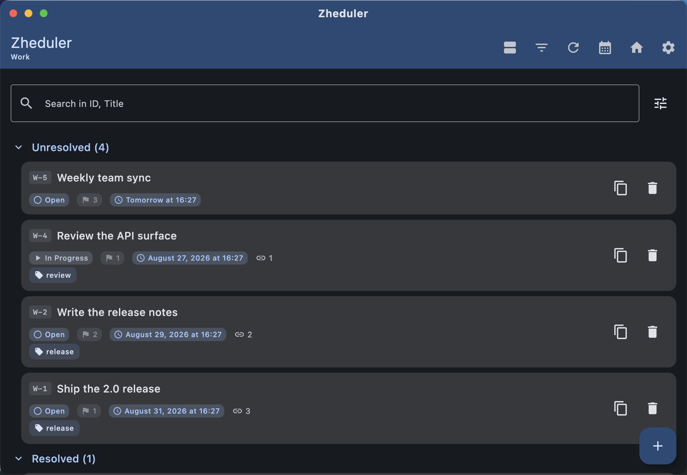
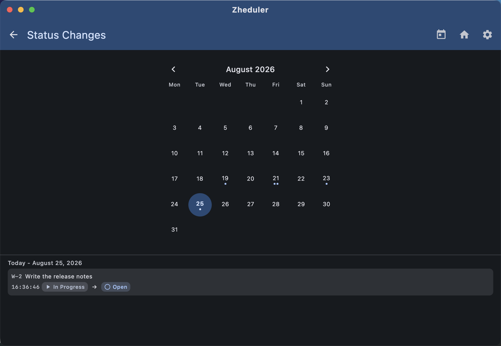
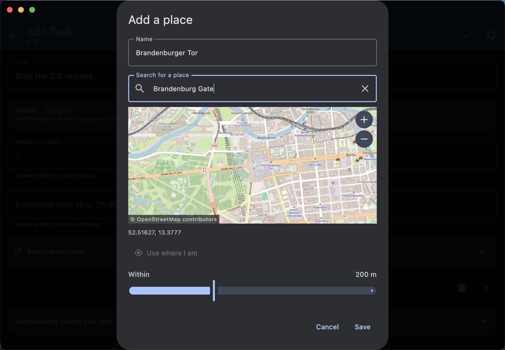
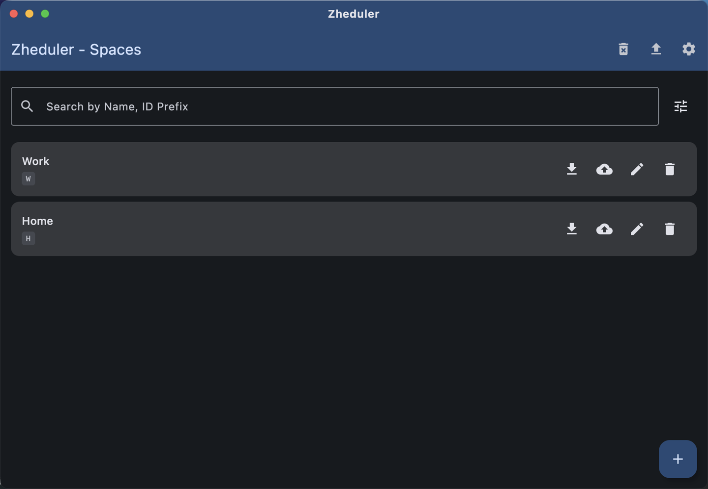
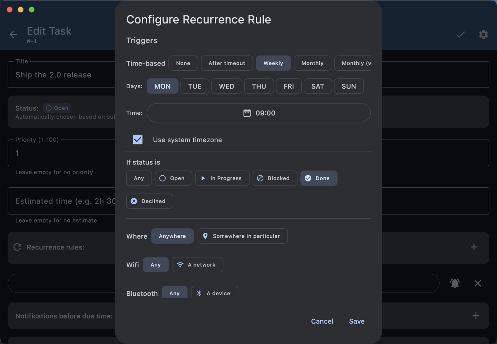
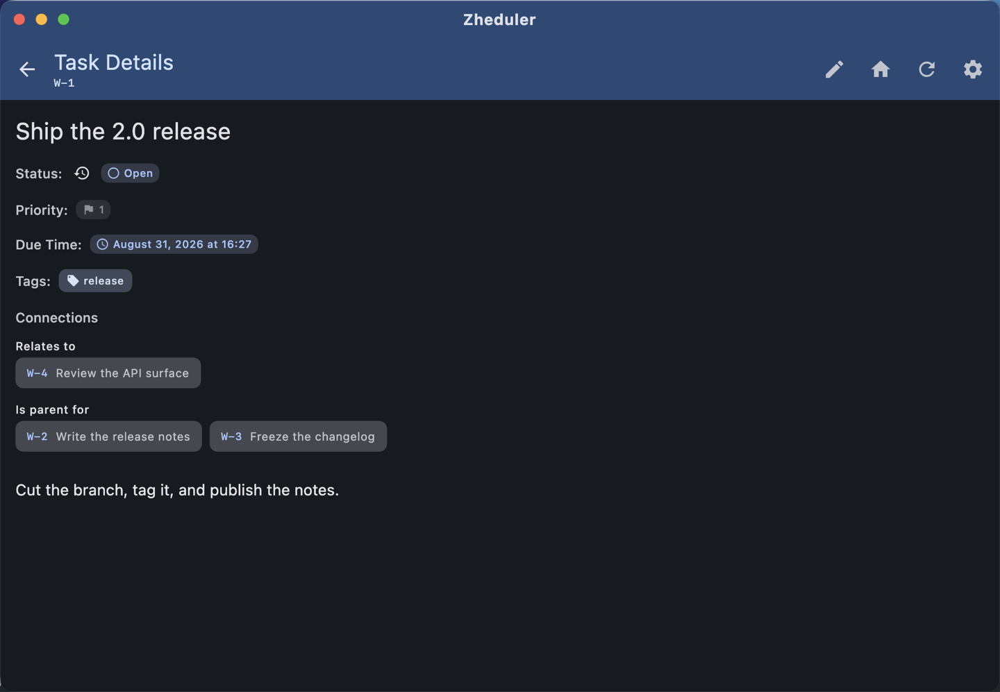
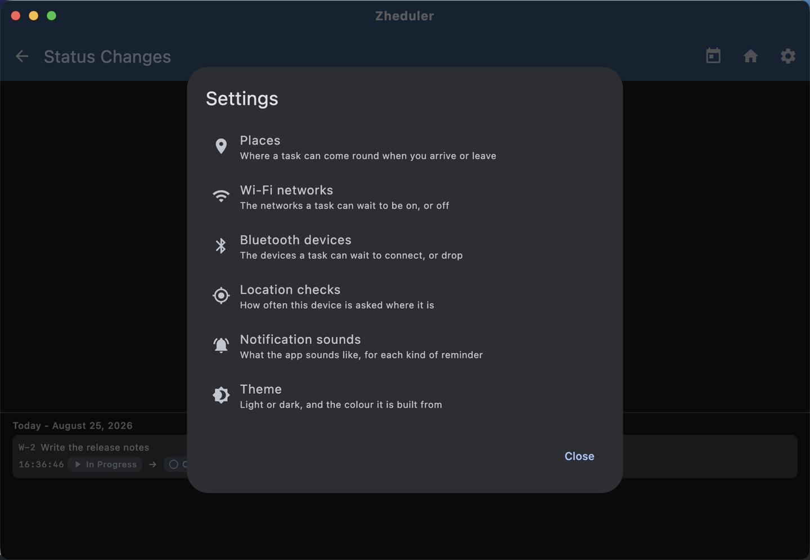

# Zheduler

Zheduler is a task manager for people whose tasks are not all due at a time. A task can come
back when you mark it done, when you arrive at a place, when your phone joins a network, or when
your car connects — as well as on a schedule. The same app runs on Android, iOS, desktop and the
web, with an optional self-hosted server for a space you want to reach from all of them.

## Screenshots

| Task list | Status changes | Place editor |
| --- | --- | --- |
|  |  |  |

## Key features

### Spaces, subtasks and dependencies

Tasks are organised into spaces. A task can depend on other tasks and can be split into subtasks
that roll up into their parent, so finishing the last blocker is what makes the next thing workable.

### View modes, filters and search

Each space's list is grouped and ordered the way you define, and you can keep several such view
modes and switch between them. Saved filters and search narrow the list further.

### Status change history

Each space keeps a record of how its tasks have moved between statuses: a month grid marks the
days on which something changed, and picking a day lists each change with its time.

### Recurrence and reminders

Recurrence rules bring tasks back; reminders arrive as native notifications, each with its own
choice of sound. On Android they arrive even with the app closed; elsewhere the app catches up
when you next open it. A device that was off for a week comes back to one task to do today, not
a week's pile of alerts.

### Rules that fire on a status change

A rule can wait for what happens to the task rather than for a moment: "when I mark this done,
put it back on the list."

### Rules that fire on a place, a network or a device

A rule can fire on arriving at or leaving a place — a point and a radius — on joining or leaving
a Wi-Fi network, or on a Bluetooth device connecting or disconnecting. Saved places, networks and
devices live in address books you pick from, each entry under a name you gave it.

### A built-in map

Places are picked on an OpenStreetMap map with search by name, pan and zoom. It is drawn on every
platform and needs no API key or account.

### Rich task details

Descriptions are Markdown or rich text — everywhere except the JS web target, which has the plain
Markdown field only. Tasks carry due dates, priorities, estimates, tags and statuses.

### One settings button

Every screen has the same settings button, and it always holds the same things: places, Wi-Fi
networks, Bluetooth devices, location checks, notification sounds and the theme — and, once you
have added one, your servers.

### Export and import

A space can be exported to a file and imported on another device.

### Self-hosted server

A space can live on your own server instead of on the device, reachable from every client you use —
it is the space itself, not a backup of one.

## Supported platforms

| Platform | Notes |
| --- | --- |
| Android | Everything works. |
| iOS | Wi-Fi and Bluetooth rules do not fire. |
| Desktop: Windows, macOS, Linux | Rules about places do not fire; Bluetooth rules also do not fire on Windows. |
| Web: Wasm and JS | Wi-Fi and Bluetooth rules do not fire in a browser; the JS target has no rich-text editor. |
| Server (optional) | Self-hosted; keeps a space your other devices connect to. |

## Getting started

You need JDK 21 and, for the mobile targets, Android Studio or Xcode; the Gradle wrapper needs
no separate Gradle install. The commands below are for macOS/Linux; on Windows use `gradlew.bat`
instead of `./gradlew`.

- Android: `./gradlew :androidApp:assembleDebug`
- Desktop: `./gradlew :composeApp:run`
- Web, Wasm target (faster, modern browsers): `./gradlew :composeApp:wasmJsBrowserDevelopmentRun`
- Web, JS target (slower, supports older browsers): `./gradlew :composeApp:jsBrowserDevelopmentRun`
- Server: `ZHEDULER_STORAGE=memory ./gradlew :server:run` to try it out; for real use, point
  `ZHEDULER_DB_URL`, `ZHEDULER_DB_USER` and `ZHEDULER_DB_PASSWORD` at a PostgreSQL database.
- iOS: open `iosApp/iosApp.xcodeproj` in Xcode and run from there.

A deployed copy of the web app must be served cross-origin isolated, with the
`Cross-Origin-Opener-Policy` and `Cross-Origin-Embedder-Policy` headers set; the dev server
already does this. Without them the app cannot open its database and shows a database error
instead of starting.

On every push to `master` and every pull request, CI leaves run artifacts: `.deb`, `.msi` and
`.dmg` desktop installers, the debug and release Android APKs, the JS and WebAssembly web bundles,
the server fat jar, and an iOS simulator build. Nothing is signed for distribution; the debug
APK installs as-is.

---

Zheduler is built with [Kotlin Multiplatform](https://www.jetbrains.com/help/kotlin-multiplatform-dev/get-started.html)
and [Compose Multiplatform](https://github.com/JetBrains/compose-multiplatform/#compose-multiplatform).
